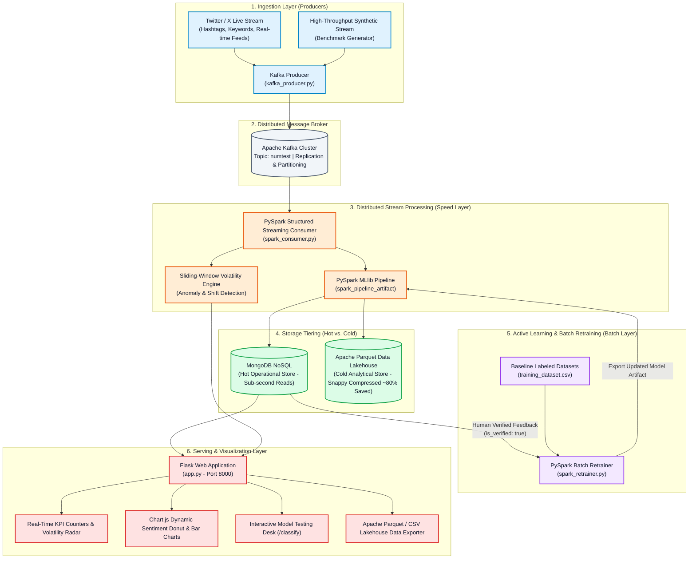
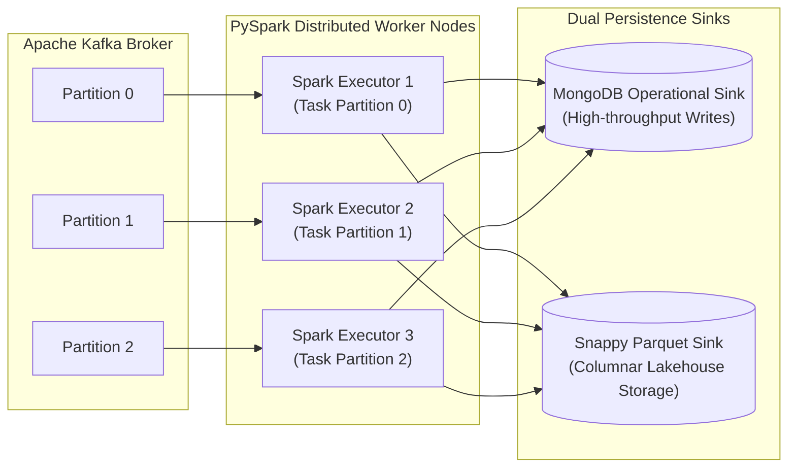
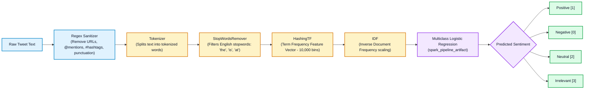
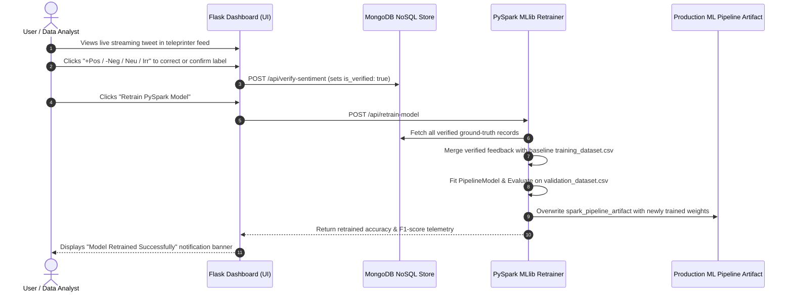
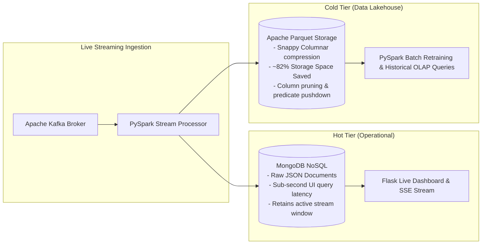
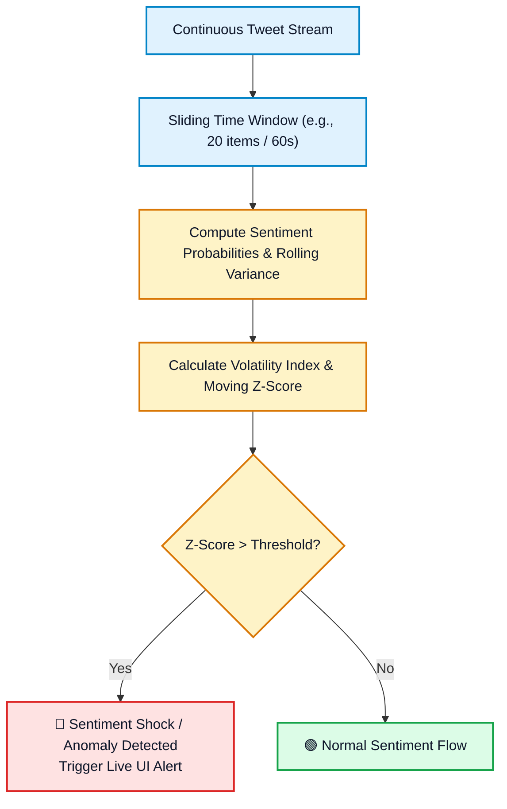

# Real-Time Twitter Sentiment Analysis Pipeline

[](https://www.python.org/)
[](https://kafka.apache.org/)
[](https://spark.apache.org/)
[](https://www.mongodb.com/)
[](https://palletsprojects.com/p/flask/)
[](https://www.docker.com/)

A scalable, end-to-end Big Data pipeline designed for **real-time ingestion, distributed stream processing, machine learning-driven sentiment classification, and live visual monitoring** of Twitter / X data.

---

## 📌 System Architecture & Pipeline Diagrams

### 1. End-to-End Big Data Pipeline Architecture (Lambda Architecture)



---

### 2. Distributed Streaming & Partitioning Topology



---

### 3. PySpark MLlib NLP Feature Extraction Pipeline



---

### 4. Human-in-the-Loop Active Learning Feedback Loop



---

### 5. Storage Tiering (Hot vs. Cold Lakehouse Architecture)



---

### 6. Sliding-Window Volatility & Anomaly Radar Pipeline



---

### 7. Historical Architecture Reference


*Figure 1: High-level architectural pipeline flow demonstrating live streaming from Twitter through Kafka brokers and Apache Spark MLlib classification into MongoDB persistence and the serving web tier.*

---

## 🚀 Key Features

- **Real-Time Streaming Ingestion**: Kafka producers dynamically scrape live tweets across configurable keywords (`#AI`, `#Crypto`, `#Tesla`, `#Bitcoin`, etc.) or custom topics and stream them into Kafka topics.
- **Distributed Stream Inference**: PySpark consumers process incoming message streams, perform NLP text sanitization (removing URLs, mentions, and special characters), and execute inference using a pre-trained PySpark MLlib Pipeline.
- **Trained PySpark ML Model**: Multiclass Logistic Regression model with Tokenizer, StopWordsRemover, and HashingTF/IDF classifying tweets into 4 categories:
  - `Positive`
  - `Negative`
  - `Neutral`
  - `Irrelevant`
- **Data Persistence**: Stores real-time classified tweets in MongoDB (supports local MongoDB or cloud MongoDB Atlas).
- **Interactive Flask Dashboard**:
  - **Live Analytics (`/`)**: Real-time KPI summary counters, dynamic sentiment distribution charts (Pie and Bar plots via Chart.js), and searchable/filterable tweet tables.
  - **Tweet Scraper & Sentiment Studio (`/scrape`)**: Instant on-demand scraping by keyword or hashtag with immediate sentiment scoring and database persistence.
  - **Model Classifier Playground (`/classify`)**: Test custom text or sentences against the PySpark ML model in real time.
- **Full Dockerization**: Instant deployment of ZooKeeper, Kafka, MongoDB, Flask Web UI, Kafka Producer, and PySpark Consumer using Docker Compose.

---

## 📂 Repository Structure

```
Real-Time-Twitter-Sentiment-Analysis/
├── kafka_spark_streaming/        # Ingestion & Streaming Layer
│   ├── kafka_producer.py         # Live tweet scraper & Kafka stream publisher
│   ├── spark_consumer.py         # Spark streaming consumer & ML inference engine
│   └── spark_retrainer.py        # Active learning PySpark batch retrainer
├── pyspark_model_training/       # Machine Learning Layer
│   ├── spark_notebook.ipynb      # Jupyter notebook for model training & evaluation
│   ├── spark_pipeline_artifact/  # Exported PySpark PipelineModel
│   ├── training_dataset.csv      # Baseline training dataset (~74,682 tweets)
│   └── validation_dataset.csv    # Validation dataset (~998 tweets)
├── webapp/                       # Web & Active Learning Layer
│   ├── app.py                    # Flask server, REST APIs & SSE stream
│   ├── tweet_scraper.py          # Tweet scraping utilities (Nitter / Syndication)
│   ├── templates/                # Jinja2 templates (index, classify, base)
│   │   ├── base.html             # Global vintage masthead layout
│   │   ├── index.html            # Real-time ledger & active learning desk
│   │   └── classify.html         # Single text test interface
│   └── static/                   # Static assets
│       ├── css/style.css         # Vintage parchment & stamp stylesheet
│       └── js/dashboard.js       # Interactive Chart.js & teleprinter logic
├── project_diagrams/             # Architecture flowcharts and project images
├── Dockerfile                    # Container definition for web and worker services
├── docker-compose.yml            # Multi-container orchestration config
├── requirements.txt              # Python dependencies
├── .env.example                  # Environment variables template
└── README.md                     # Project documentation
```

---

## 📊 Dataset Description

The machine learning model was trained and evaluated on the [Twitter Entity Sentiment Analysis Dataset](https://www.kaggle.com/datasets/jp797498e/twitter-entity-sentiment-analysis):
- **Features**: `Tweet ID`, `Entity`, `Sentiment` (Target: Positive, Negative, Neutral, Irrelevant), and `Tweet Content`.
- **Training Set (`training_dataset.csv`)**: 74,682 labeled tweets.
- **Validation Set (`validation_dataset.csv`)**: 998 labeled tweets.

---

## 🛠️ Prerequisites

- **Python 3.9+**
- **Java OpenJDK 8 or 11** (Required for Apache Spark & PySpark)
- **Docker & Docker Compose** (Recommended for easiest setup)
- **MongoDB** (Local instance or MongoDB Atlas URI)

---

## ⚙️ Configuration (.env)

Create a `.env` file in the root directory (or copy from `.env.example`):

```env
# MongoDB Configuration
MONGO_URI=mongodb://localhost:27017/
MONGO_DB_NAME=bigdata_project
MONGO_COLLECTION_NAME=tweets

# Kafka Configuration
KAFKA_BOOTSTRAP_SERVERS=localhost:9092
KAFKA_TOPIC=numtest
STREAM_INTERVAL_SECONDS=3.0

# Flask Configuration
PORT=8000
SECRET_KEY=sentiment-analysis-secret-key
```

---

## 🐳 Quickstart with Docker Compose (Recommended)

To launch the complete infrastructure (Zookeeper, Kafka, MongoDB, Producer, Spark Consumer, and Web UI) in one command:

```bash
# Build and start all services in detached mode
docker-compose up --build -d
```

Once running, access the web interface at **`http://localhost:8000`**.

To stop the services:
```bash
docker-compose down
```

---

## 💻 Manual Setup & Execution

If you prefer to run services locally outside of Docker:

### 1. Install Dependencies
```bash
python -m venv venv
# On Windows:
.\venv\Scripts\activate
# On Linux/macOS:
source venv/bin/activate

pip install -r requirements.txt
```

### 2. Start Kafka & MongoDB
Ensure you have Apache Kafka running on `localhost:9092` and MongoDB on `localhost:27017` (or provide a cloud MongoDB Atlas connection string in your `.env`).

### 3. Run the PySpark Consumer & Classifier
```bash
cd kafka_spark_streaming
python spark_consumer.py
```

### 4. Run the Kafka Producer (Live Tweet Streamer)
```bash
cd kafka_spark_streaming

# Continuous streaming across trending topics:
python kafka_producer.py --continuous

# Or stream tweets for a specific topic / hashtag:
python kafka_producer.py --query "#Bitcoin" --count 50
```

### 5. Launch the Flask Web Dashboard
```bash
# From the project root:
python webapp/app.py
```


Open your browser and navigate to:
- **Live Dashboard**: [http://127.0.0.1:8000](http://127.0.0.1:8000)
- **Live Scraper & Studio**: [http://127.0.0.1:8000/scrape](http://127.0.0.1:8000/scrape)
- **Interactive Classifier**: [http://127.0.0.1:8000/classify](http://127.0.0.1:8000/classify)

---

## 🌐 Web Application & API Endpoints

| Route | Method | Description |
|---|---|---|
| `/` | `GET` | Main real-time sentiment analytics dashboard with KPI cards and Chart.js graphs |
| `/classify` | `GET`, `POST` | Interactive model testing desk for single-sentence or custom text inference |
| `/api/stats` | `GET` | Returns aggregated sentiment count metrics & real-time proportions |
| `/api/tweets` | `GET` | Returns the latest classified tweets from MongoDB |
| `/api/stream-tweets` | `GET` | Server-Sent Events (SSE) live real-time tweet feed stream |
| `/api/scrape-analyze` | `POST` | On-demand keyword/hashtag scraping & sentiment scoring batch endpoint |
| `/api/classify` | `POST` | Programmatic JSON sentiment classification endpoint |
| `/api/verify-sentiment` | `POST` | Human-in-the-Loop label feedback endpoint (marks `is_verified: true`) |
| `/api/verified-stats` | `GET` | Returns telemetry on human-verified ground-truth sample count in MongoDB |
| `/api/retrain-model` | `POST` | Triggers PySpark MLlib batch retraining and updates pipeline model weights |
| `/api/lakehouse/stats` | `GET` | Returns Apache Parquet Lakehouse compression metrics & stream volatility index |
| `/api/lakehouse/export-parquet` | `GET` | Downloads current streaming records as Snappy-compressed Apache Parquet |
| `/api/lakehouse/export-csv` | `GET` | Downloads current streaming records as structured CSV dataset |
| `/api/clear-db` | `POST` | Clears operational MongoDB collection on demand |
| `/api/health` | `GET` | Cluster connectivity and service health check probe |

---

## 👥 Contributors & Acknowledgements

- **Driss Khattabi** ([@drisskhattabi6](https://github.com/drisskhattabi6))
- **Ayman Boufarhi** ([@aymanboufarhi](https://github.com/aymanboufarhi))
- **Abdelali Ibn Tabet** ([@abd-ibn](https://github.com/abd-ibn))

**Supervised By**: Prof. **Yasyn El Yusufi**  
*Faculty of Sciences and Technology of Tangier — Abdelmalek Essaadi University*  
*Master: Artificial Intelligence and Data Science (Module: Big Data)*
